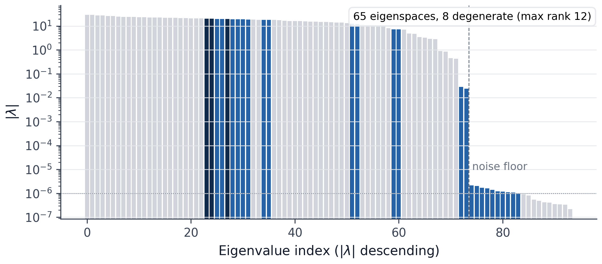
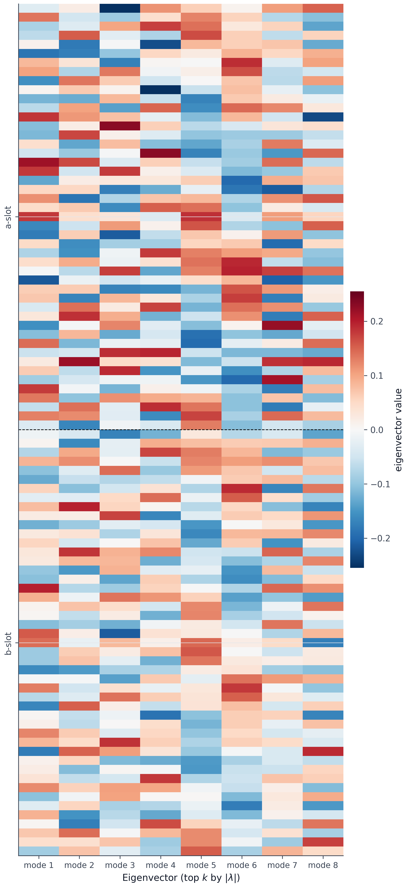
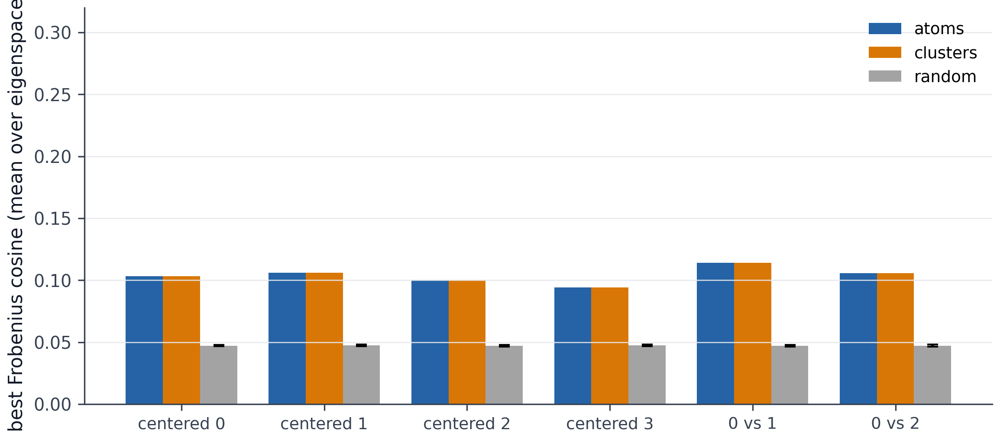
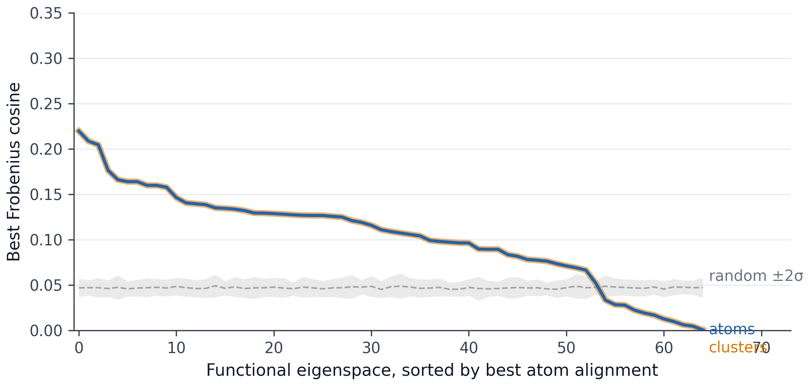
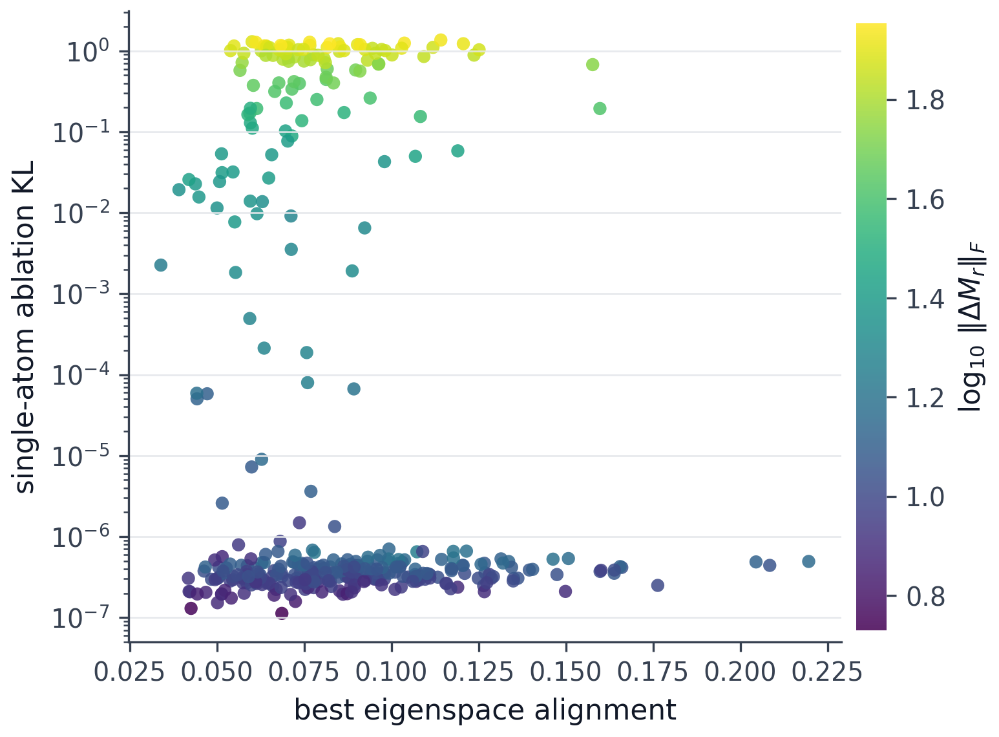
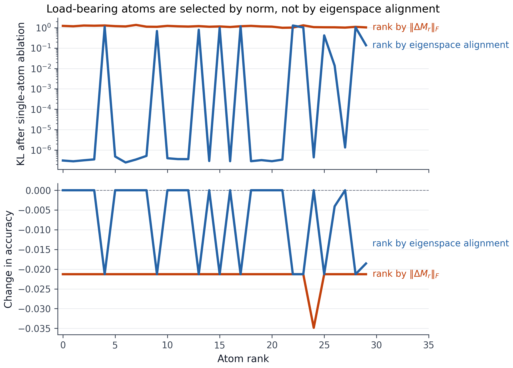
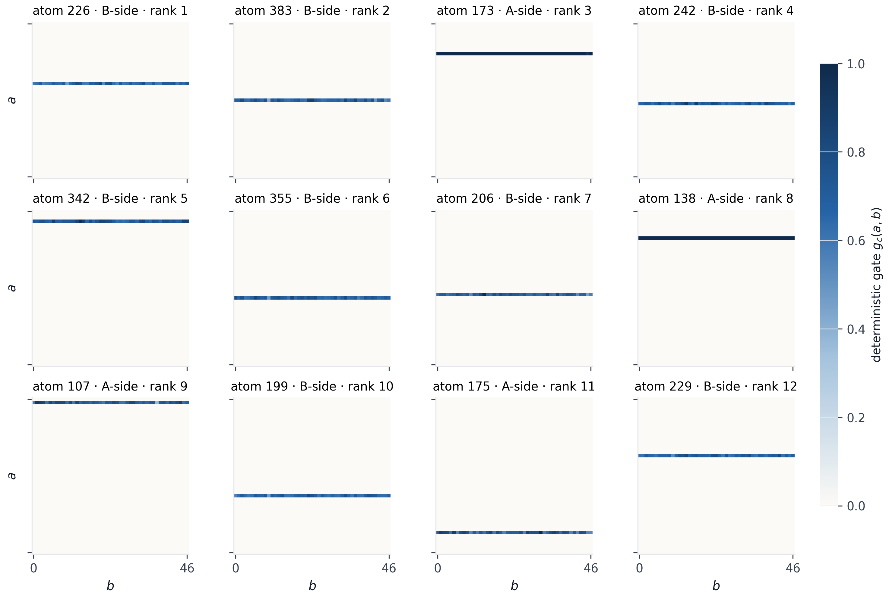
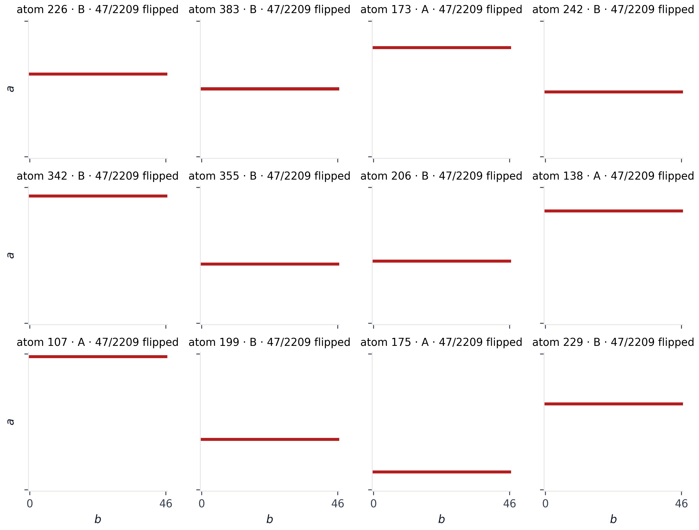
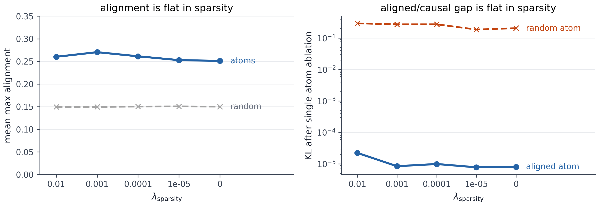

# Do Rank-One Parameter Decompositions Recover Bilinear Mechanisms?

**Epistemic status:** Small controlled experiment on a single architecture
(bilinear MLP), a single task (modular addition, $p \in \{13, 23, 47\}$),
and a single decomposition method (a minimal SPD-style rank-one gated
decomposition). The "ground truth" used is probe-conditioned — for a
chosen output direction $r$, the bilinear MLP induces an exact quadratic
form $x^\top M_r x$, and the eigenspaces of $M_r$ are a canonical
functional decomposition of *that scalar probe*, not of the whole model.
I think the benchmark setup is more interesting than the particular
numbers below; the result is shown to be stable across a sparsity-pressure
sweep but still needs other decomposition families (PPGD, VPD-style) and
other tasks before any of it should be generalised. Code is at
<https://github.com/aniket-desh/bilinear-param-decomp>.

## TL;DR

I trained a small bilinear MLP to grok modular addition, computed the
exact probe-conditioned interaction matrices $M_r$, eigendecomposed them,
and trained a minimal SPD-style rank-one gated parameter decomposition
on the bilinear weights $(A, B)$. The decomposition converges cleanly
(behaviour KL $\sim 10^{-4}$, relative parameter reconstruction
$\sim 10^{-5}$, with $\approx 1$ atom having a non-negligible
deterministic gate per input).

I expected one of two outcomes: either atoms or clusters of co-active
atoms would recover the eigenspaces of $M_r$. **Neither happened.**
Instead the decomposition reliably converges to a different — and
also-interpretable — ontology:

- Atoms beat a random size-matched baseline at Frobenius-cosine
  alignment by $1.6 - 2.2\times$ ($25 - 56\sigma$), but absolute
  alignment caps at $0.10 - 0.24$.
- Clusters add nothing — gate co-activation is sparse to the point of
  triviality, and cluster MMA equals atom MMA to three decimals.
- **Causally**, the most-aligned atoms are *not* the load-bearing ones.
  Single-atom ablation of the highest-alignment atoms changes behaviour
  KL by $\sim 10^{-7}$; ablating the high-$\|\Delta M_r\|_F$ atoms
  instead changes KL by $\sim 1.2$ and removes accuracy on exactly one
  row or column of the $p \times p$ lookup table per atom.
- A sparsity-pressure sweep on $p = 13$ across
  $\lambda_s \in \{10^{-2}, 10^{-3}, 10^{-4}, 10^{-5}, 0\}$ shows the
  shard ontology is **not** an artefact of the sparsity penalty — it
  appears across all five settings.

The headline:

> **Faithful parameter atoms need not be functional mechanisms.** A
> rank-one gated decomposition can be behaviourally faithful,
> parameter-faithful, and causally interpretable — and still pick a
> different ontology from the model's spectral functional decomposition.

In this bilinear MLP the SPD-style decomposition learned an
input-table **shard** ontology — each high-norm atom carries one row or
column of the $p \times p$ lookup table — instead of the Fourier-like
$M_r$-eigenspace ontology that the theory pointed at. This is an
*ontology mismatch* between parameter-space faithfulness and
function-space spectral structure, not a failure of either side.

## Why I cared about this

Sparse autoencoders decompose activations. The parameter-decomposition
lineage from Goodfire — APD, SPD, VPD — instead decomposes the weights
that produce those activations, on the bet that *the unit of
computation* lives more naturally in parameter space than in
activation space.

This is attractive but slippery: if I learn a rank-one atom $u_c v_c^\top$
in weight space, I don't immediately know what *function-space* object
it corresponds to. The atom carries causal-importance values
$g_c(x) \in [0, 1]$, but those gates are training-objective artefacts;
nothing about "decomposes $A$ into rank-one pieces, used sparsely per
input, sums back to the original" guarantees that the pieces are the
right ontological cut.

Choosing the right unit of decomposition is one of the recurring
[open problems in mechanistic interpretability](https://arxiv.org/abs/2501.16496).
The hard part is that in real language models we typically have no
ground-truth functional decomposition to compare against. Without a
ground truth, "did our atoms find the mechanisms?" is unanswerable;
we can only check that they reconstruct, are sparsely used, and act
faithfully on the behaviour distribution.

**Bilinear MLPs give exactly that ground truth.** For a probe $r$,
the scalar $r^\top y(x)$ is an exact quadratic form
$x^\top M_r x$ in the input. The eigenspaces of $M_r$ are then a
canonical, basis-independent functional decomposition of that scalar
probe. So we can ask a very concrete question:

> Do the rank-one parameter atoms learned by an SPD-style
> decomposition align with the eigenspaces of $M_r$?

That's the whole post.

## The central problem: parameter space is not function space

A rank-one parameter atom $u_c v_c^\top$ is a $d_\text{in} \times d_\text{hidden}$
matrix. An eigenspace of $M_r$ is a subspace of $\mathbb{R}^{d_\text{in}}$
(equivalently, a rank-$r$ orthogonal projector $P_\lambda$ acting on
$d_\text{in} \times d_\text{in}$ symmetric matrices). They live in
different objects.

The bridge — borrowed from the bilinear-MLP literature
([Sharkey 2023](https://arxiv.org/abs/2305.03452); [Lee, Bills, Wang & Lee 2024](https://arxiv.org/abs/2410.08417))
and a basic perturbation expansion — is the *functional perturbation*
induced by atom $c$:

$$
\Delta M_r(\{c\}) = M_r(A, B, C, r) - M_r(A - \Delta A_c, B - \Delta B_c, C, r).
$$

Now both sides of the comparison are symmetric $d_\text{in} \times d_\text{in}$
matrices, and we can ask things like

$$
\text{align}(c, P_\lambda) = \frac{|\langle \Delta M_r(\{c\}), P_\lambda \rangle_F|}{\|\Delta M_r(\{c\})\|_F \,\|P_\lambda\|_F},
$$

i.e., the absolute Frobenius cosine. The same construction applies to
*clusters* of atoms — we just sum the rank-one updates into the
weights before reconstructing $M_r$, which keeps the bilinear cross
term right.

The benchmark question becomes:

- **H1** — individual atoms align well with eigenspaces;
- **H2** — atoms alone do not, but co-activation clusters of atoms do;
- **H3** — neither aligns.

## Bilinear MLPs give an exact functional object

A bilinear MLP, in the [Lee et al. 2024](https://arxiv.org/abs/2410.08417) form,
computes

$$
h(x) = (x^\top A) \odot (x^\top B), \qquad y(x) = h(x) C,
$$

with $A, B \in \mathbb{R}^{d_\text{in} \times d_\text{hidden}}$ and
$C \in \mathbb{R}^{d_\text{hidden} \times d_\text{out}}$. The absence of a
nonlinearity is what makes this special: every output coordinate is a
true quadratic in $x$. So for any probe $r \in \mathbb{R}^{d_\text{out}}$,

$$
r^\top y(x) = x^\top M_r x, \qquad M_r = \tfrac{1}{2} \sum_i (Cr)_i \big( a_i b_i^\top + b_i a_i^\top \big).
$$

$M_r$ is symmetric, so we can eigendecompose it cleanly:
$M_r = Q \Lambda Q^\top$. The eigenspaces of $M_r$ are the canonical
basis-independent decomposition of the scalar probe $r^\top y(x)$ into
orthogonal quadratic modes.

A subtlety the rest of the post leans on: $M_r$ frequently has
*degenerate* eigenvalues, in which case there is no canonical choice
of eigenvectors *within* a degenerate group. The right invariant is
the projector $P_\lambda$ onto that group — not any specific
eigenvector — and all the alignment metrics below are projector-based
for that reason.

## A small benchmark

**Task.** Modular addition $(a + b) \bmod p$ for $p \in \{13, 23, 47\}$.
The input is the concatenation of one-hot encodings of $a$ and $b$, so
$d_\text{in} = 2p$. The output is a $p$-way softmax.

I train the bilinear MLP in a *grokking-friendly* regime: small
initialisation ($\sigma = 0.02$), strong weight decay ($1.0$), no
accuracy-based early stop, full-table batches. This is a deliberate
choice — the benchmark only makes sense if $M_r$ has nontrivial
functional structure to compare against, and the grokking regime is
the one in which a bilinear MLP develops Fourier-like algorithmic
structure (the standard
[Nanda et al.](https://arxiv.org/abs/2301.05217) setup). After
training, $M_r$ has many degenerate eigenspaces and the leading
eigenvectors are visibly periodic across the two input slots.

For p47 the spectrum looks like this:



*Spectrum of $M_r$ for the centered class probe $r = e_0 - \tfrac{1}{p}\mathbf{1}$
on the grokked p47 model. Bar colour encodes group type: light gray =
singleton eigenspace, blue = degenerate (rank ≥ 2) eigenspace, dark
blue = the largest degenerate group (here rank 12). The dashed line
marks the spectral cliff between leading functional modes and the
noise floor.*

The top eigenvectors show periodic structure across both input slots:



*Top-8 eigenvectors of $M_r$ as columns. Each column is a
$2p = 94$-dim vector split into the $a$-slot (rows 0–46) and the
$b$-slot (rows 47–93) at the dashed line. Visible (slightly
muddied) periodicity across both slots indicates the bilinear MLP
implements a Fourier-flavoured modular-addition algorithm.*

So the functional object exists, is non-trivial, and looks
algorithmically meaningful.

**Decomposition.** A minimal SPD-style rank-one gated decomposition of
the bilinear factors:

$$
A \approx \sum_{c=1}^{C_A} u^A_c (v^A_c)^\top, \qquad B \approx \sum_{c=1}^{C_B} u^B_c (v^B_c)^\top,
$$

with $C_A = C_B = 2 d_\text{hidden}$, and a small gate MLP per side that
maps $x$ to per-atom causal-importance values
$g^A(x), g^B(x) \in [0, 1]^{C}$ via a lower-leaky sigmoid. On each
training input we apply *stochastic masks* $m_c = g_c + (1 - g_c) U(0,1)$
to each atom (Goodfire SPD's idea; the mask is $\ge g_c$, so a low
gate corresponds to "this atom is dispensable"). The four-term loss is

$$
\mathcal L = \lambda_b \,\mathrm{KL}\big(\mathrm{softmax}(y_\text{target}) \,\big\|\, \mathrm{softmax}(\hat y)\big) + \lambda_A \frac{\|A - \hat A\|_F^2}{\|A\|_F^2} + \lambda_B \frac{\|B - \hat B\|_F^2}{\|B\|_F^2} + \lambda_s \|g\|_1 + \lambda_f L_\text{freq}(g).
$$

I deliberately did *not* implement Persistent PGD; spec § 1 deferred
it as optional, and this benchmark is about the parameter/function-space
comparison, not a faithful reproduction of the full Goodfire SPD/VPD
training stack. The sigmoids, KL loss, and frequency penalty are
cherry-picked verbatim from
[Goodfire's `nano_param_decomp/run.py`](https://github.com/goodfire-ai/param-decomp/tree/spd-paper),
with attribution comments in the source. Everything else is from
scratch.

**Decomposition training.** 20 000 steps × 4 mask samples per step on
an RTX A6000, full-table batches, AdamW lr = 10⁻³,
$\lambda_b = \lambda_A = \lambda_B = 1$, $\lambda_s = \lambda_f = 10^{-3}$.
All three runs hit the spec acceptance criteria comfortably:

| run | $C_A = C_B$ | KL | recon $A$ | recon $B$ | mean #gates > $10^{-3}$ per sample |
|---|---:|---:|---:|---:|---:|
| `modadd_p13_grok` | 64 | 5.6×10⁻⁴ | 1.4×10⁻⁵ | 1.2×10⁻⁵ | 1.24 / 64 |
| `modadd_p23_grok` | 96 | 2.3×10⁻⁴ | 1.3×10⁻⁵ | 1.7×10⁻⁵ | 1.11 / 96 |
| `modadd_p47_grok` | 192 | 4.2×10⁻⁴ | 1.6×10⁻⁵ | 1.3×10⁻⁵ | 1.04 / 192 |

The right-most column is the deterministic gate $L_0$ — the average
number of atoms with $g_c(x) > 10^{-3}$ per input. Note that during
training the actual per-input mask is *stochastic*,
$m_c = g_c + (1 - g_c) U(0, 1)$, so a gate near zero is not literally
absent; it's "if I drop you on this input, the model still works."
But across all three configs, only $\approx 1$ atom has a
non-negligible deterministic gate on any given input, despite $C$
varying by 3×. We expected $\sim 5 - 20$ atoms per eigenspace; the
decomposition instead found a way to mark only one atom as
behaviourally important per input.

## Alignment results — atoms beat baseline, clusters don't help

For each probe $r$ I build the alignment matrix
$\text{align}[c, j] = |\text{fro}\_\text{cos}(\Delta M_r(\{c\}), P_{\lambda_j})|$,
then summarise with `mean_max_alignment` on the eigenspace axis: for
each eigenspace, take the best-aligned atom; average across
eigenspaces. This is "is every eigenspace covered by *some* atom?"
Same thing for clusters. As a chance baseline I generate the same
quantity from 32 random symmetric matrices of matched shape.

| run | $d$ | n eigenspaces | atom MMA | cluster MMA | random MMA | atom/random | z-score |
|---|---:|---:|---:|---:|---:|---:|---:|
| `modadd_p13_grok` | 26 | 23 | **0.24** | 0.24 | 0.15 ± 0.005 | 1.6× | ≈ 25σ |
| `modadd_p23_grok` | 46 | 41 | **0.14** | 0.14 | 0.09 ± 0.002 | 1.6× | ≈ 30σ |
| `modadd_p47_grok` | 94 | 65 | **0.10** | 0.10 | 0.05 ± 0.001 | 2.2× | ≈ 56σ |

Two readings:

1. The above-baseline ratio is consistent (1.6–2.2×) and the
   statistical separation is huge (25σ–56σ). So the SPD-style atoms
   are recovering *something* that has Frobenius-overlap with the
   eigenspaces.
2. The absolute alignment is small: 0.10–0.24 on a [0, 1] scale, well
   short of the "near-1" we'd want for H1. And cluster MMA equals
   atom MMA to three decimals — there is no H2 lift at all.

For p47:



*Atoms (blue) and clusters (amber) are visibly equal-height across
all six probes, both ~2× the gray random-baseline bar; absolute
alignment caps at $\approx 0.11$. Y-axis is capped at 0.30 — the
story is the separation from random, not closeness to 1.*

Zooming in to one probe (`centered_0`), the per-eigenspace coverage
profile makes the H1/H2/H3 question very direct:



*For each eigenspace (sorted by best atom alignment desc), the blue
curve is the maximum atom alignment; the amber halo behind it is the
maximum cluster alignment; the gray ±2σ band is what a random
size-matched set of symmetric matrices would produce. If H1 held the
blue curve would start near 1. If H2 held, the amber halo would sit
above the blue curve. In fact the blue and amber curves are
indistinguishable — clustering provides no lift — and the blue curve
stays in $[0.05, 0.22]$, well above random but well below recovery.
About 50 / 65 eigenspaces have a non-trivial atom overlap; the bottom
15 cross into the random band.*

Why doesn't clustering help? Because in this regime the atoms are
*nearly orthogonal* in their co-activation pattern. At correlation
threshold $\tau = 0.5$, p47 has 380 / 384 atoms as singletons; even
$\tau = 0.6$ leaves only 2 nontrivial clusters of size 2. With only
$\approx 1$ atom carrying a non-trivial deterministic gate per
sample, and 2 209 inputs, each atom fires on a small, distinctive
subset and rarely co-activates with another atom.

At this point the picture would suggest "H3 — nothing aligns", with
a footnote that the 1.6–2.2× over-baseline signal is statistically
real but might just be a numerical coincidence rather than mechanism
recovery. Causal ablation lets us tell which.

## Causal ablation — the most-aligned atoms are not load-bearing

The single most informative figure in this project is the
per-atom plot of alignment vs causal load-bearing:



*Each dot is one atom. X-axis: its best Frobenius cosine to any
$M_r$-eigenspace projector. Y-axis: the KL between the unperturbed
target and the model with this atom surgically removed (log scale).
Color encodes $\log_{10} \|\Delta M_r\|_F$ — the atom's "size" in
function space. The top band (KL $\sim 1$) is the load-bearing
atoms; the bottom band (KL $\sim 10^{-7}$) is the dispensable atoms.
The load-bearing band is colored bright (high norm); the dispensable
band is colored dark (low norm). Alignment (x-axis) does not
separate the two bands — the rightmost dot (highest-aligned atom) is
in the dispensable band.*

Per spec § 5.9, the right test for the headline atoms is to
*surgically remove* an atom from the weights and measure behaviour
change directly. For atom set $S$, build
$A_{-S} = A - \sum_{c \in S \cap A} u^A_c (v^A_c)^\top$ and
$B_{-S} = B - \sum_{c \in S \cap B} u^B_c (v^B_c)^\top$, then evaluate
the *plain bilinear* forward $((x A_{-S}) \odot (x B_{-S})) C$ — no
gates, no masks, just the perturbed weights. Compare against three
size-matched controls per eigenspace:

- **Aligned cluster** — the cluster containing the best-aligned atom
  for that eigenspace (a singleton in our regime, so usually one
  atom);
- **Random size-matched** — 100 random atom sets of the same size,
  excluding the aligned atom;
- **Low-alignment** — atoms in the bottom-quartile alignment to that
  eigenspace, with cumulative $\|\Delta M_r\|_F$ roughly matched to
  the aligned set.

I picked the top-5 eigenspaces per probe by atom MMA and ablated all
three sets per eigenspace. The median single-atom KL on the full
$p^2$-input table (median because random's heavy tail dominates the
mean) is striking:

| run | median aligned KL | median random KL | median low-align KL |
|---|---:|---:|---:|
| `modadd_p13_grok` | 1.5×10⁻⁵ | 2.5×10⁻¹ | 1.4×10⁻⁵ |
| `modadd_p23_grok` | 1.1×10⁻⁶ | 3.0×10⁻¹ | 1.0×10⁻⁶ |
| `modadd_p47_grok` | 4.3×10⁻⁷ | 1.9×10⁻¹ | 3.9×10⁻⁷ |

**Aligned and low-alignment ablations are indistinguishable** — both
sit 5+ orders of magnitude below the random baseline. The
"most-aligned" atoms are no more load-bearing than the "least-aligned"
ones. Across 30 eigenspaces per run, the aligned KL exceeded the
random *mean* only 3 / 30, 7 / 30, and 1 / 30 times respectively, and
exceeded random by > 1σ even less often.

This isn't a subtle effect. Whatever Frobenius-cosine alignment is
measuring, it isn't tracking causal importance in our regime.

## So what is load-bearing?

The dual test: rank atoms by $\|\Delta M_r\|_F$ (raw functional
perturbation size) instead of by alignment, and walk down the top-K.



*The orange line (rank by $\|\Delta M_r\|_F$) sits flat at the top
of the y-axis: every one of the top-30 norm-ranked atoms collapses
behaviour ($\mathrm{KL} \sim 1$, $\Delta\text{acc} \approx -2\%$).
The blue line (rank by eigenspace alignment) is a step function
between the high-impact band and the floating-point floor — about
8 / 30 of the top-aligned atoms happen to also be load-bearing,
the other 19 / 30 do nothing when removed. So alignment is a noisy,
~3× over-random selector for load-bearing atoms, while norm is a
near-perfect one. The two top-10 sets overlap in only 0 – 1 atoms
across the three p values (p13: 1/10, p23: 0/10, p47: 1/10).*

So the "best aligned" and the "load-bearing" populations are nearly
disjoint.

What do the high-norm atoms actually do? Their single-atom
$\Delta\text{acc}$ is suspiciously consistent within each run:

| run | top-norm $\Delta$acc | $-\Delta\text{acc} \times p^2$ | what this is |
|---|---:|---:|---|
| p13 | −0.0769 | $= 13$ | exactly one row or column of $13 \times 13$ |
| p23 | −0.0435 | $= 23$ | exactly one row or column of $23 \times 23$ |
| p47 | −0.0213 | $= 47$ | exactly one row or column of $47 \times 47$ |

Each high-norm atom is causally responsible for exactly one row or
column of the modular-addition lookup table — i.e., for all $(a, b)$
pairs where $a$ takes a specific value, or where $b$ takes a specific
value. The decomposition has learned an "addition-table shard"
ontology: roughly $2p$ atoms each handle one value of one argument,
and the remaining atoms are residual decoration.

We can see the shards directly. For the top-12 atoms by
$\|\Delta M_r\|_F$ on p47, the deterministic gate $g_c(a, b)$ over
the input grid:



*Each panel is one atom's $g_c$ as a function of $(a, b)$ on the
$47 \times 47$ input table. The shard hypothesis predicts a clean
horizontal or vertical stripe — that is exactly what every top-norm
atom looks like.*

And the matching per-input ablation-error mask:



*Same atoms; red cells are inputs where the model's argmax flips
after that single atom is surgically removed. Each high-norm atom
kills exactly 47/2 209 = 1/47 of the table — the one row (or
column) where its gate fires. (In this seed the very top-norm
atoms are all a-row shards; b-column shards exist too but appear
deeper in the ranking — across the top-40 the rough split is 32
row, 7 column, 1 mixed.)*

## Is the shard ontology forced by the sparsity penalty?

The obvious objection: maybe $\lambda_s = 10^{-3}$ pushed the gates
into a near-singleton regime, and that's what made the decomposition
look like shards. To check, I re-trained the p13 decomposition five
times against the same frozen bilinear MLP at
$\lambda_s \in \{10^{-2}, 10^{-3}, 10^{-4}, 10^{-5}, 0\}$ and re-ran
alignment + ablation each time.



*Left: atom mean-max-alignment (blue) stays flat at $\approx 0.26$
across all five settings while the random baseline (gray, dashed)
stays at $\approx 0.15$ — a flat $\sim 1.7\times$ ratio, no
convergence toward 1. Right: median single-atom ablation KL for
the best-aligned atom (blue) stays at $\sim 10^{-5}$; the random
size-matched control (orange) stays at $\sim 10^{-1}$ — flat
5-orders-of-magnitude gap between geometric and causal selection,
regardless of $\lambda_s$.*

So removing the sparsity pressure entirely doesn't recover the
eigenspace ontology — the shard solution is what this decomposition
converges to in this setup, not an artefact of one $\lambda_s$ choice.
That doesn't rule out more aggressive interventions (different
architecture for the gate net, PPGD, rank-$r$ atoms) preventing the
collapse, but it does rule out the simplest "you forced it" objection.

## Interpretation

The benchmark gives a clean verdict on the three hypotheses:

- **H1 (atoms ≈ eigenspaces): refuted.** Alignment caps at 0.10 – 0.24,
  far short of "atom is the eigenspace projector". More importantly,
  ablating the best-aligned atom changes behaviour by $\sim 10^{-7}$
  KL — the alignment metric isn't even tracking which atom matters.
- **H2 (clusters ≈ eigenspaces): refuted.** The gate co-activation
  matrix is essentially the identity in this regime, so clustering
  produces almost only singletons, and the cluster MMA equals the
  atom MMA to three decimals.
- **H3 (nothing aligns): technically true for the eigenspace target,
  but the framing misses the point.** The decomposition didn't *fail*
  to find structure. It found a *different* structure — a
  per-row/column lookup-table shard of the $p \times p$ table — that
  is real, causal, basis-independent in its own way, and stable
  across a sparsity sweep, just not the eigenspace decomposition the
  theory pointed at.

The cleanest framing I can give:

> I expected H1 (atom ↔ eigenspace) or H2 (cluster ↔ eigenspace).
> Instead the decomposition converged to **row/column shards**: a
> causal, sparse, input-local ontology that is not the
> Fourier/eigenspace ontology of the bilinear function. This is an
> ontology mismatch between parameter-space faithfulness and
> function-space spectral structure, not a failure of either side.

The alignment-vs-eigenspace metric *almost-works* — the
1.6–2.2× over-baseline signal is statistically real, and the same atoms
do have non-trivial Frobenius overlap with the eigenspaces — but
"the atoms with the highest Frobenius cosine to an eigenspace
projector" is not the same set as "the atoms that *implement* that
eigenspace's functional contribution to the bilinear product". The
shard-vs-mechanism mismatch is the place where the parameter
decomposition and the functional decomposition pull apart.

## What this benchmark does and doesn't show

It shows:

- a clean, end-to-end-reproducible setup for asking the parameter-vs-function
  alignment question on a model with a known functional ontology;
- that in this decomposition family ($C = 2 d_\text{hidden}$,
  stochastic-mask SPD without PPGD), and across
  $\lambda_\text{sparsity} \in \{10^{-2}, 10^{-3}, 10^{-4}, 10^{-5}, 0\}$,
  the rank-one decomposition reliably converges to lookup-table
  shards — the shard ontology is *not* an artefact of a single
  sparsity choice;
- that geometric alignment to eigenspace projectors is a *real but
  insufficient* signal of mechanism recovery — the same atoms that
  score highest on it are not the same atoms that carry the
  computation.

It does not show:

- that SPD-style decompositions can't recover mechanisms in *some*
  regime (lower sparsity may well let atoms be larger and less
  shard-like);
- that the same picture holds for VPD-style adversarial-mask or
  Persistent-PGD training, which I didn't implement (see "Limitations");
- that a different ground-truth functional object — e.g.
  data-weighted projectors, or the Fourier basis directly, or
  attribution-based perturbations — wouldn't yield a much cleaner H1
  on the same atoms;
- much about real language-model SPD, whose decompositions live on a
  different scale and at substantially higher $L_0$.

## Limitations

- **No PPGD.** Goodfire's `nano_param_decomp` includes a
  Persistent-PGD path that adversarially searches the mask space.
  This benchmark uses pure stochastic masks. PPGD might prevent the
  shard collapse and give the atoms a chance to look more
  eigenspace-like; the sparsity sweep above doesn't speak to it.
- **One decomposition family.** I didn't implement VPD-style
  subcomponent training or attribution-based decompositions; those
  could plausibly produce different atoms.
- **One task.** Modular addition has a very clean Fourier algorithm
  available; bilinear MLPs trained on tasks without a clean
  algorithmic solution might not have a Fourier-flavored functional
  decomposition for atoms to misalign with in the first place.
- **Frobenius alignment is not the only metric.** A data-weighted
  inner product $\langle \Delta M_r, P \rangle_x = \mathbb E_x [x^\top \Delta M_r x \cdot x^\top P x]$
  might be more meaningful, since it weights the projector overlap by
  where inputs actually live. I didn't try it.
- **Gate-correlation clustering is brittle in this regime.** With
  near-singleton gates the correlation matrix is sparse by
  construction; spectral clustering on the gate Gram matrix or
  Jaccard on gate supports would be more reasonable tries.
- **One seed.** Everything is at `seed = 0`. The shard pattern is
  unlikely to be seed-specific given how clean it is, but I didn't
  verify.

## What I'd try next

- Persistent-PGD: drop in nano's PPGD path and re-run alignment. This
  is the most direct test of whether the shard collapse is specific
  to pure stochastic-mask training.
- Rank-$r$ block-term atoms: replace rank-one $u_c v_c^\top$ with
  rank-$r$ blocks. This directly addresses the type-signature mismatch
  between rank-one atoms and rank-2+ degenerate eigenspaces.
- Data-weighted alignment metric.
- Same benchmark on a non-modular-addition bilinear MLP — e.g., a
  parity / XOR-of-features task — where the functional eigenspaces
  look less algorithmic.

## Acknowledgements

The four cherry-picked pieces from
[Goodfire's `nano_param_decomp/run.py`](https://github.com/goodfire-ai/param-decomp/tree/spd-paper)
(lower/upper-leaky sigmoid, KL loss, frequency penalty, stochastic
mask sampler) are credited inline in `src/bilinear_spd/sigmoids.py` and
`src/bilinear_spd/losses.py`. The bilinear-MLP formulation and the
$M_r$-eigendecomposition idea are from
[Lee, Bills, Wang & Lee 2024](https://arxiv.org/abs/2410.08417) and
[Sharkey 2023](https://arxiv.org/abs/2305.03452). The
"choosing-the-right-unit" framing is from
[Open Problems in Mechanistic Interpretability](https://arxiv.org/abs/2501.16496).
APD and SPD are
[Braun et al. 2025](https://arxiv.org/abs/2501.14926) and
[Bushnaq et al. 2025](https://arxiv.org/abs/2506.20790).

## Code

<https://github.com/aniket-desh/bilinear-param-decomp>

Reproduce the whole pipeline with:

```bash
git clone https://github.com/aniket-desh/bilinear-param-decomp.git
cd bilinear-param-decomp
uv sync                                                       # or pip install -e ".[dev]"
pytest                                                         # 31 passes
for c in modadd_p13_grok modadd_p23_grok modadd_p47_grok; do
    python -m scripts.train_bilinear   configs/${c}.yaml
    python -m scripts.analyze_functional configs/${c}.yaml
    python -m scripts.train_decomp     configs/${c}.yaml
    python -m scripts.run_alignment    configs/${c}.yaml
    python -m scripts.run_ablation     configs/${c}.yaml
    python -m scripts.run_rank_ablation configs/${c}.yaml --probe centered_0
done
```

p47 needs ~10 min for bilinear training plus ~10 min for the
decomposition on an A6000; the smaller configs finish in 1–2 min
each.

## Comments invited

I'd be especially interested in feedback on:

1. **Is $M_r$-eigenspace the right functional object?** The
   data-weighted variant
   $\langle \Delta M_r, P \rangle_x = \mathbb E_x [x^\top \Delta M_r x \cdot x^\top P x]$
   feels like a more principled alignment metric — anyone tried it?
2. **PPGD vs. pure stochastic.** Would Goodfire's Persistent-PGD path
   prevent the shard collapse, or just produce neater shards?
3. **Is "shards instead of mechanisms" a known pathology of
   rank-one weight decompositions, or is this the first toy
   demonstration?** I haven't seen it discussed in the SPD/VPD writeups
   directly, but I might be missing prior work.
4. **A non-modular-addition target.** Suggestions for a bilinear MLP
   task with a less algorithmic functional decomposition would be
   welcome.

## Methods details

**Bilinear MLP.** $d_\text{in} = 2 p$ (concat one-hot of $a$ and $b$),
$d_\text{hidden} \in \{32, 48, 96\}$ for $p \in \{13, 23, 47\}$,
no bias. AdamW lr $3 \times 10^{-3}$, weight decay 1.0,
initialization scale 0.02, full-table batches, 30 k / 40 k / 60 k
steps. The grokking-friendly config is `configs/modadd_p<p>_grok.yaml`.

**Eigenspace grouping.** Signed-proximity tolerance
$|\lambda_i - \lambda_j| \le \tau \cdot \max_k |\lambda_k|$ with
$\tau = 0.01$ and minimum $|\lambda|$ floor $10^{-6}$. Projector
invariants $P^2 = P$, $P^\top = P$, $\mathrm{tr}\, P = \mathrm{rank}\, P$
are tested in `tests/test_eigenspace_projectors.py`.

**Decomposition.** $C_A = C_B = 2 d_\text{hidden}$, gate MLP hidden width
192 (constant across runs), final-layer bias 0.5 so initial gates ≈ 0.5
(otherwise all atoms start dead). Loss weights
$\lambda_b = \lambda_A = \lambda_B = 1$,
$\lambda_s = \lambda_f = 10^{-3}$. 20 k steps × 4 stochastic mask
samples per step, AdamW lr $10^{-3}$, full-table batches.

**Alignment.** $|\text{fro\_cos}|$ between $\Delta M_r$ and each
eigenspace projector. `mean_max_alignment` on the eigenspace axis:
$\frac{1}{n_\text{eig}} \sum_j \max_c |\text{fro\_cos}(\Delta M_r(\{c\}), P_{\lambda_j})|$.
Random baseline: 32 trials of $n_\text{atoms}$ random symmetric
matrices of the same shape, taking mean ± std.

**Clustering.** Pearson correlation matrix of stacked
$[g_A | g_B] \in \mathbb{R}^{N \times (C_A + C_B)}$ (dead atoms
zeroed); BFS connected components of the $|\mathrm{corr}| > \tau$
graph; threshold sweep $\tau \in \{0.5, 0.6, 0.7, 0.8, 0.9\}$,
reported threshold $\tau = 0.7$.

**Ablation.** $(A_{-S}, B_{-S})$ surgical subtraction of rank-one
contributions; evaluate plain bilinear forward — no gates, no masks.
Metrics: KL behaviour, $\Delta$accuracy, $\Delta$mean top-2 logit
margin, $\Delta$probe-scalar $r^\top y(x)$. Random baseline: 100
random atom sets of the same size as the aligned cluster, excluding
the aligned atom.

**Test suite.** 31 tests total (`pytest`):

- 4 shape tests on data + model + $M_r$;
- 2 functional-equivalence tests ($r^\top y(x) = x^\top M_r x$) at
  random init and post-training;
- 3 eigenspace projector invariants;
- 5 decomposition forward + ablation invariants;
- 4 metric invariants ($P^2 = P$, projector-energy ∈ {0, 1}, etc.);
- 3 perturbation-expansion identities (the bilinear cross-term must
  appear in cluster ablation);
- 3 clustering tests (correlation diagonals, connected-component
  edges, size summary);
- 6 ablation invariants (empty-set is identity, single-atom
  subtraction matches the outer product, etc.).
