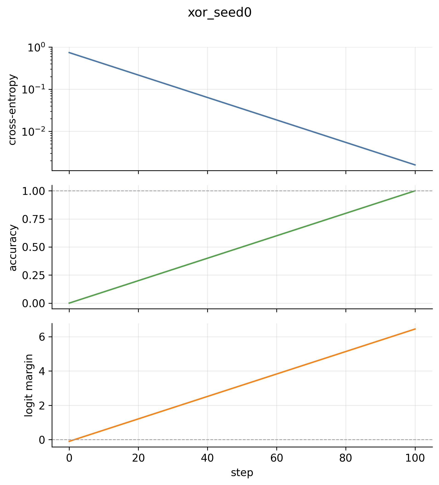
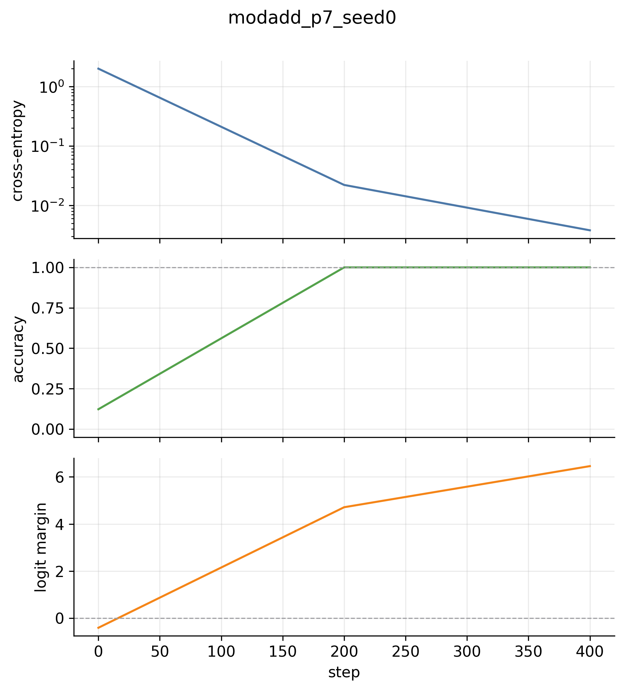
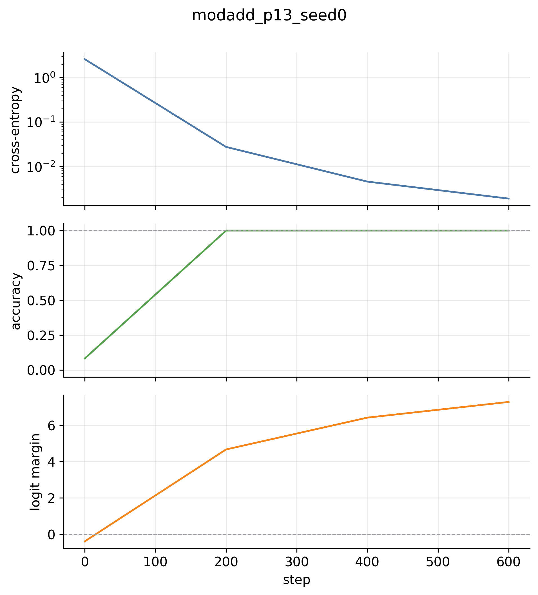
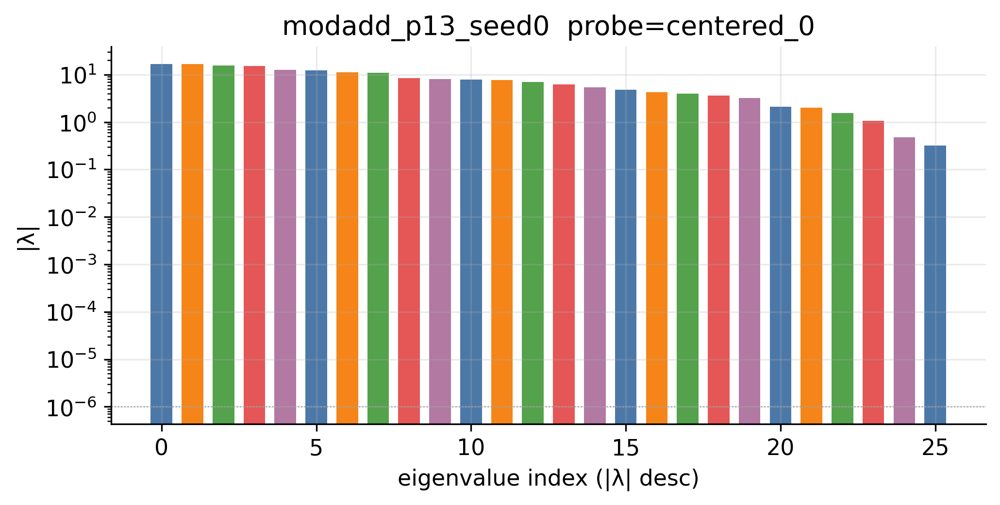
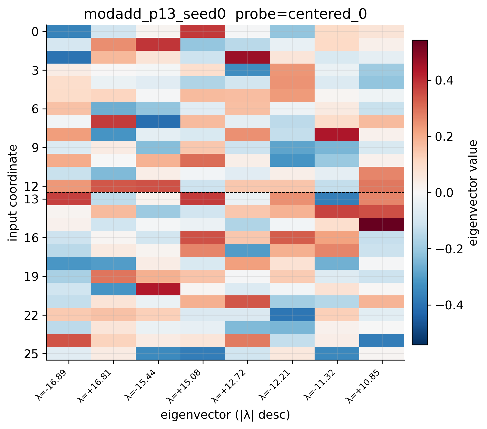

# Bilinear-SPD Benchmark — Progress Summary

Living document. Updated as days roll in.

## Project one-line

Train a tiny bilinear MLP on modular addition, build the exact probe-conditioned
interaction matrix $M_r$, learn an SPD-style rank-one gated decomposition of the
bilinear weights $(A, B)$, and ask whether atoms (or clusters of co-active atoms)
align with the eigenspaces of $M_r$.

Theory writeup and codebase spec are kept locally and not committed.

## Reuse decisions (made before Day 1)

The Goodfire `param-decomp` repo was inspected and not vendored. The four
small pieces we will cherry-pick from it on later days (sigmoids with leaky
backward, importance-minimality loss, stochastic-mask sampler, cosine LR) are
~100 lines total and will be pasted with attribution comments. Everything else
— the bilinear MLP, $M_r$, eigenspace grouping, gated decomposition over
raw $A,B$ parameters, clustering by gate correlations, alignment metrics,
ablations, plotting, tests — is written from scratch because Goodfire's
implementation is tightly coupled to LM/transformer/DDP/WandB/SLURM
infrastructure we don't need for this benchmark.

## Day 1 — repo skeleton + bilinear MLP + $M_r$ equivalence

### What landed

- **Package**: `src/bilinear_spd/` with `utils.py`, `data.py`, `models.py`,
  `functional.py`, `train.py`, `plotting.py`.
- **Configs**: `configs/{xor, modadd_p7, modadd_p13}.yaml`. Device defaults
  to `cpu`; auto-detect available for cuda/mps.
- **CLI**: `python -m scripts.train_bilinear configs/<name>.yaml` writes
  `runs/<run_name>/{config.yaml, checkpoints/, artifacts/, figures/, reports/}`.
- **Tests**: 6 pytests covering dataset shapes, model forward shape, $M_r$
  shape + symmetry, and the central correctness check
  $r^\top y(x) \;=\; x^\top M_r x$ at both random init and post-training.

### Functional-equivalence sanity check

The most important sanity check in the project. For all three configs, after
training, $\max_n |r^\top y(x_n) - x_n^\top M_r x_n|$ stays at floating-point
noise.

| run | params | steps to 99% acc | wall (CPU) | $\|r^\top y - x^\top M_r x\|_\infty$ |
|---|---:|---:|---:|---:|
| `xor` | 80 | 9 | <1 s | 4.8e-07 |
| `modadd_p7` | 840 | 105 | ~1 s | 9.5e-07 |
| `modadd_p13` | 2 080 | 111 | 3.6 s | 1.7e-06 |

All numbers come from `runs/<name>/reports/run_summary.json` after a fresh CPU
run on an M2 Air. Probe used for the check is the centered class probe
$r = e_0 - \tfrac{1}{p}\mathbf{1}$.

### Test suite

```text
tests/test_functional_equivalence.py ..  (random-init + post-train probes)
tests/test_shapes.py                ....  (dataset, forward, M_r shape+symmetry)
6 passed in 20.58s
```

The 20 s wall is dominated by torch import; raw test work is <1 s.

### Training curves

#### XOR (`runs/xor_seed0/`)



#### Modular addition, $p = 7$ (`runs/modadd_p7_seed0/`)



#### Modular addition, $p = 13$ (`runs/modadd_p13_seed0/`)



All three runs reach 100% accuracy well before the configured step budget and
early-stop on the spec's 99%-for-N-steps criterion. Logit margins are healthy
(>4 by the early-stop point), so the models are confidently fitting the table
rather than sitting at a decision boundary.

### Hardware note

Whole project is comfortably CPU on a 16 GB M2 Air. The largest run
(`modadd_p13`) is 2 080 parameters and finishes in under 4 seconds wall.

## Day 2 — eigendecomposition + projector grouping + spectrum figures

### What landed

- `functional.py`: `eigendecompose_M` (eigh, sorted by $|\lambda|$ desc) and
  `group_eigenspaces` (signed-proximity grouping with $\tau \cdot \max_k|\lambda_k|$
  tolerance, $\min |\lambda|$ floor, returns `EigenGroup` dataclass with
  `indices`, `evals`, `projector`, `rank`, `mean_abs_eval`).
- `build_probes(cfg, p)`: materializes centered-class and pairwise probes from
  the YAML config block.
- `plotting.py`: `plot_spectrum` (bar plot of $|\lambda|$ colored by group,
  degeneracy annotations) and `plot_top_eigenvectors` (heatmap split at the
  a-slot / b-slot boundary).
- `scripts/analyze_functional.py`: load checkpoint → build probes → $M_r$ per
  probe → equivalence sanity check → eigendecompose → group → save
  `artifacts/{mr_slices.pt, eigenspaces.pt}` → save spectrum +
  eigenvector figures per probe → write `reports/functional_summary.json`.
- `tests/test_eigenspace_projectors.py`: $P^2 = P$, $P^\top = P$,
  $\mathrm{tr}\,P = \mathrm{rank}\,P$ on a random symmetric matrix, on a
  freshly trained $p=7$ checkpoint, AND on a hand-constructed matrix with a
  known rank-3 degenerate eigenspace.

Full test suite: **9/9 pass**.

### Spectra

| run | probe | $\max\,\|r^\top y - x^\top M_r x\|$ | groups @ τ=1e-3 | top $\|λ\|$ |
|---|---|---:|---:|---:|
| xor | pairwise_0_1 | 9.5e-07 | 4 (0 degenerate) | 7.13 |
| modadd_p7 | centered_0 | 9.5e-07 | 14 (0 degenerate) | 10.09 |
| modadd_p7 | pairwise_0_1 | 1.9e-06 | 14 (0 degenerate) | 17.84 |
| modadd_p13 | centered_0 | 1.7e-06 | 26 (0 degenerate) | 16.89 |
| modadd_p13 | pairwise_0_1 | 2.9e-06 | 26 (0 degenerate) | 29.41 |

Equivalence holds at floating-point noise across all probes.

#### modadd_p13 — centered class probe $r = e_0 - \tfrac{1}{p}\mathbf{1}$




### The interesting finding: the model is in the memorization regime

The current trained model produces **zero degenerate eigenspaces at $\tau = 10^{-3}$** across all probes. Theory (`docs/01` §12) predicts that a model learning the
*algorithmic* solution to modular addition should exhibit degenerate eigenspaces
from translation equivariance — same-sign pairs of eigenvalues corresponding to
the cosine/sine modes of each Fourier frequency. We see none of that.

Sweeping the tolerance on `modadd_p13 / centered_0`:

| $\tau$ | groups | degenerate |
|---:|---:|---:|
| 0.001 | 26 | 0 |
| 0.01 | 26 | 0 |
| 0.02 | 25 | 1 |
| 0.05 | 19 | 6 |
| 0.10 | 8 | 4 |

You have to loosen $\tau$ to ~5% before degeneracies appear, and the eigenvalue
pairs the model *does* produce are close but *opposite-sign* (e.g. $-16.89$
vs $+16.81$, $-15.44$ vs $+15.08$) — not the same-sign sine/cosine pairs of a
Fourier algorithm. Combined with the eigenvector heatmap (no periodic
structure across the a-slot/b-slot), this is consistent with the model
memorizing the table rather than learning translation-equivariant features.

`docs/01` §12.1 anticipates exactly this:

> The bilinear MLP may memorize the table in a non-Fourier way, especially for
> small $p$ and overparameterized hidden dimension.

Our setup is squarely in that regime: $m = 32 > p = 13$ hidden units, no weight
decay, large initialization ($\sigma = 0.5$ vs the spec's suggested $0.02$),
trained for only ~600 steps before early stop. Day 1's "100% accuracy in 110
steps" was a *symptom* of the problem, not a success — it's the model finding a
local lookup-table minimum well before any algorithmic structure has time to
emerge.

This is not a bug in any of the code we wrote. Equivalence holds, projectors
are correct, plots render. The trained model is simply uninteresting from a
mechanistic standpoint.

## Up next — Day 2.5 (training-regime fix)

Before Day 3's decomposition work makes sense, we need a bilinear model that
actually learns the Fourier algorithm. Standard grokking recipe for
modular addition:

- shrink `init_scale` from 0.5 → 0.02 (spec default);
- add weight decay (~ 1.0 — yes, that high — required for grokking);
- shrink `d_hidden` closer to $p$;
- train for much longer (10k–50k steps), do **not** early-stop on accuracy;
- track $|λ|$ degeneracy ratio as a training metric so we can *see* the
  grokking transition.

I'll add a `configs/modadd_p13_grok.yaml` with these, retrain, and re-run
`analyze_functional` to confirm same-sign degenerate eigenspaces appear.
Once they do, Day 3 (the actual SPD-style decomposition) is unblocked.
