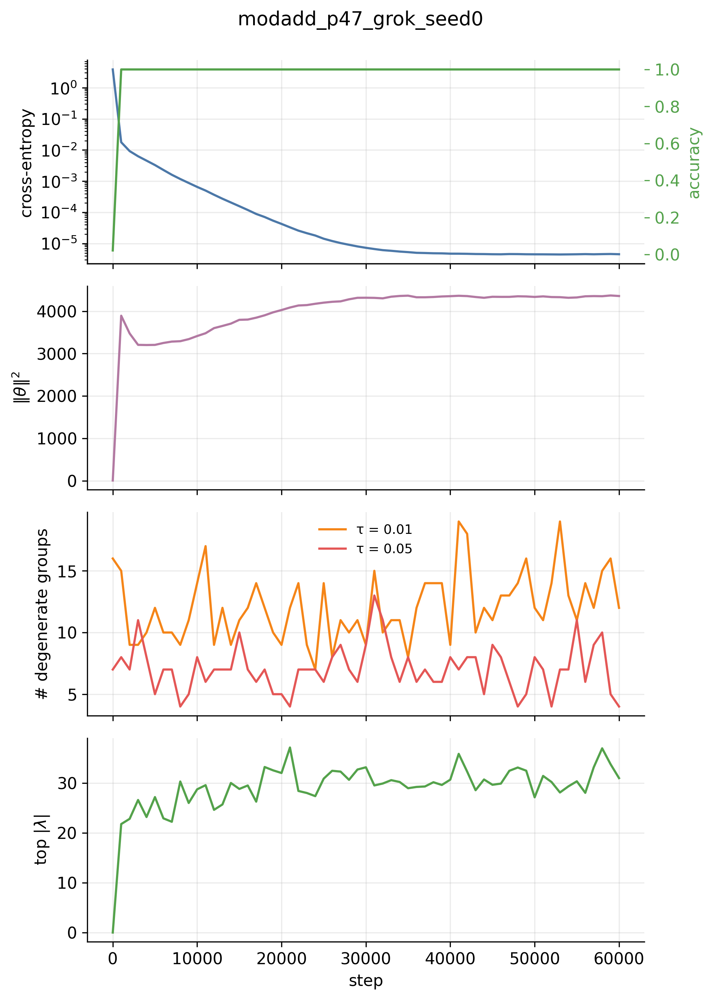
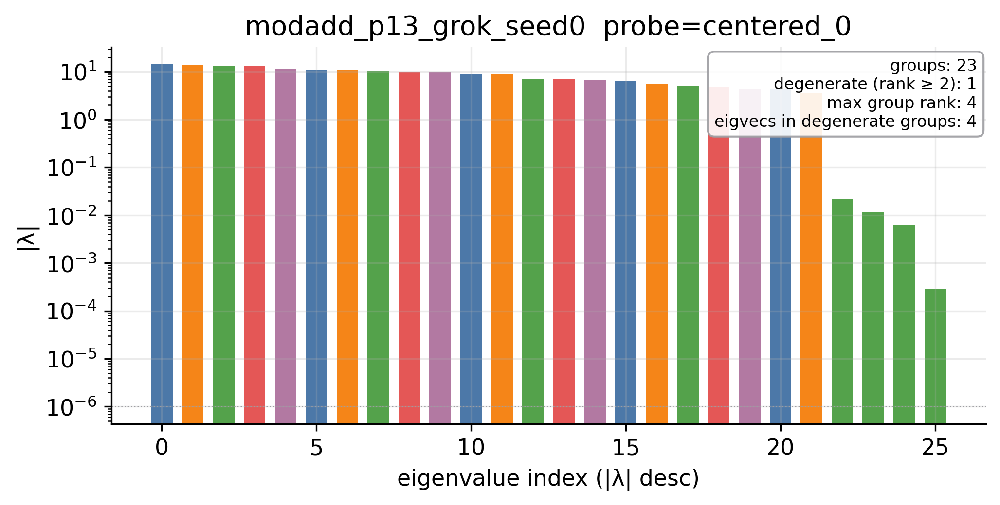
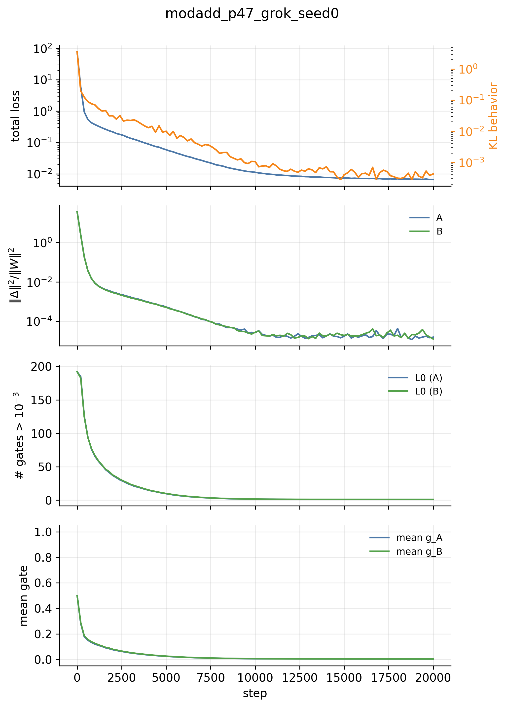
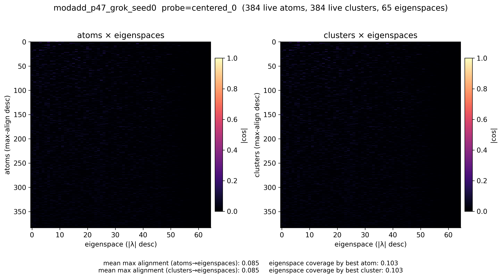

# Bilinear-SPD Benchmark — Progress Summary

Living document. Updated as days roll in.

## Project one-line

Train a tiny bilinear MLP on modular addition, build the exact probe-conditioned
interaction matrix $M_r$, learn an SPD-style rank-one gated decomposition of the
bilinear weights $(A, B)$, and ask whether atoms (or clusters of co-active atoms)
align with the eigenspaces of $M_r$.

Theory writeup and codebase spec are kept locally and not committed.

## Reuse decisions (made before Day 1)

The Goodfire `param-decomp` repo was inspected and not vendored. The four
small pieces we will cherry-pick from it on later days (sigmoids with leaky
backward, importance-minimality loss, stochastic-mask sampler, cosine LR) are
~100 lines total and will be pasted with attribution comments. Everything else
— the bilinear MLP, $M_r$, eigenspace grouping, gated decomposition over
raw $A,B$ parameters, clustering by gate correlations, alignment metrics,
ablations, plotting, tests — is written from scratch because Goodfire's
implementation is tightly coupled to LM/transformer/DDP/WandB/SLURM
infrastructure we don't need for this benchmark.

## Day 1 — repo skeleton + bilinear MLP + $M_r$ equivalence

### What landed

- **Package**: `src/bilinear_spd/` with `utils.py`, `data.py`, `models.py`,
  `functional.py`, `train.py`, `plotting.py`.
- **Configs**: `configs/{xor, modadd_p7, modadd_p13}.yaml`. Device defaults
  to `cpu`; auto-detect available for cuda/mps.
- **CLI**: `python -m scripts.train_bilinear configs/<name>.yaml` writes
  `runs/<run_name>/{config.yaml, checkpoints/, artifacts/, figures/, reports/}`.
- **Tests**: 6 pytests covering dataset shapes, model forward shape, $M_r$
  shape + symmetry, and the central correctness check
  $r^\top y(x) \;=\; x^\top M_r x$ at both random init and post-training.

### Functional-equivalence sanity check

The most important sanity check in the project. For all three configs, after
training, $\max_n |r^\top y(x_n) - x_n^\top M_r x_n|$ stays at floating-point
noise.

| run | params | steps to 99% acc | wall (CPU) | $\|r^\top y - x^\top M_r x\|_\infty$ |
|---|---:|---:|---:|---:|
| `xor` | 80 | 9 | <1 s | 4.8e-07 |
| `modadd_p7` | 840 | 105 | ~1 s | 9.5e-07 |
| `modadd_p13` | 2 080 | 111 | 3.6 s | 1.7e-06 |

All numbers come from `runs/<name>/reports/run_summary.json` after a fresh CPU
run on an M2 Air. Probe used for the check is the centered class probe
$r = e_0 - \tfrac{1}{p}\mathbf{1}$.

### Test suite

```text
tests/test_functional_equivalence.py ..  (random-init + post-train probes)
tests/test_shapes.py                ....  (dataset, forward, M_r shape+symmetry)
6 passed in 20.58s
```

The 20 s wall is dominated by torch import; raw test work is <1 s.

### Training curves

#### XOR (`runs/xor_seed0/`)


#### Modular addition, $p = 7$ (`runs/modadd_p7_seed0/`)


#### Modular addition, $p = 13$ (`runs/modadd_p13_seed0/`)


All three runs reach 100% accuracy well before the configured step budget and
early-stop on the spec's 99%-for-N-steps criterion. Logit margins are healthy
(>4 by the early-stop point), so the models are confidently fitting the table
rather than sitting at a decision boundary.

### Hardware note

Whole project is comfortably CPU on a 16 GB M2 Air. The largest run
(`modadd_p13`) is 2 080 parameters and finishes in under 4 seconds wall.

## Day 2 — eigendecomposition + projector grouping + spectrum figures

### What landed

- `functional.py`: `eigendecompose_M` (eigh, sorted by $|\lambda|$ desc) and
  `group_eigenspaces` (signed-proximity grouping with $\tau \cdot \max_k|\lambda_k|$
  tolerance, $\min |\lambda|$ floor, returns `EigenGroup` dataclass with
  `indices`, `evals`, `projector`, `rank`, `mean_abs_eval`).
- `build_probes(cfg, p)`: materializes centered-class and pairwise probes from
  the YAML config block.
- `plotting.py`: `plot_spectrum` (bar plot of $|\lambda|$ colored by group,
  degeneracy annotations) and `plot_top_eigenvectors` (heatmap split at the
  a-slot / b-slot boundary).
- `scripts/analyze_functional.py`: load checkpoint → build probes → $M_r$ per
  probe → equivalence sanity check → eigendecompose → group → save
  `artifacts/{mr_slices.pt, eigenspaces.pt}` → save spectrum +
  eigenvector figures per probe → write `reports/functional_summary.json`.
- `tests/test_eigenspace_projectors.py`: $P^2 = P$, $P^\top = P$,
  $\mathrm{tr}\,P = \mathrm{rank}\,P$ on a random symmetric matrix, on a
  freshly trained $p=7$ checkpoint, AND on a hand-constructed matrix with a
  known rank-3 degenerate eigenspace.

Full test suite: **9/9 pass**.

### Spectra

| run | probe | $\max\,\|r^\top y - x^\top M_r x\|$ | groups @ τ=1e-3 | top $\|λ\|$ |
|---|---|---:|---:|---:|
| xor | pairwise_0_1 | 9.5e-07 | 4 (0 degenerate) | 7.13 |
| modadd_p7 | centered_0 | 9.5e-07 | 14 (0 degenerate) | 10.09 |
| modadd_p7 | pairwise_0_1 | 1.9e-06 | 14 (0 degenerate) | 17.84 |
| modadd_p13 | centered_0 | 1.7e-06 | 26 (0 degenerate) | 16.89 |
| modadd_p13 | pairwise_0_1 | 2.9e-06 | 26 (0 degenerate) | 29.41 |

Equivalence holds at floating-point noise across all probes.

#### modadd_p13 — centered class probe $r = e_0 - \tfrac{1}{p}\mathbf{1}$


### The interesting finding: the model is in the memorization regime

The current trained model produces **zero degenerate eigenspaces at $\tau = 10^{-3}$** across all probes. Theory (`docs/01` §12) predicts that a model learning the
*algorithmic* solution to modular addition should exhibit degenerate eigenspaces
from translation equivariance — same-sign pairs of eigenvalues corresponding to
the cosine/sine modes of each Fourier frequency. We see none of that.

Sweeping the tolerance on `modadd_p13 / centered_0`:

| $\tau$ | groups | degenerate |
|---:|---:|---:|
| 0.001 | 26 | 0 |
| 0.01 | 26 | 0 |
| 0.02 | 25 | 1 |
| 0.05 | 19 | 6 |
| 0.10 | 8 | 4 |

You have to loosen $\tau$ to ~5% before degeneracies appear, and the eigenvalue
pairs the model *does* produce are close but *opposite-sign* (e.g. $-16.89$
vs $+16.81$, $-15.44$ vs $+15.08$) — not the same-sign sine/cosine pairs of a
Fourier algorithm. Combined with the eigenvector heatmap (no periodic
structure across the a-slot/b-slot), this is consistent with the model
memorizing the table rather than learning translation-equivariant features.

`docs/01` §12.1 anticipates exactly this:

> The bilinear MLP may memorize the table in a non-Fourier way, especially for
> small $p$ and overparameterized hidden dimension.

Our setup is squarely in that regime: $m = 32 > p = 13$ hidden units, no weight
decay, large initialization ($\sigma = 0.5$ vs the spec's suggested $0.02$),
trained for only ~600 steps before early stop. Day 1's "100% accuracy in 110
steps" was a *symptom* of the problem, not a success — it's the model finding a
local lookup-table minimum well before any algorithmic structure has time to
emerge.

This is not a bug in any of the code we wrote. Equivalence holds, projectors
are correct, plots render. The trained model is simply uninteresting from a
mechanistic standpoint.

## Day 2.5 — training-regime fix + p sweep

### What landed

- `train_bilinear` now optionally tracks "grok metrics" every $N$ steps:
  parameter $L^2$ norm, top $|\lambda|$ of $M_r$ for a tracked probe, and
  the number of degenerate eigenspace groups at one or more tolerances.
- `plot_grokking_curves`: 4-panel diagnostic (loss + acc, $\|\theta\|^2$,
  degenerate-group count at $\tau \in \{0.01, 0.05\}$, top $|\lambda|$).
- `plot_spectrum`: replaced the colliding per-group text annotations with a
  single corner summary box (groups / degenerate / max rank / eigvecs in
  degenerate).
- Three grokking configs: `modadd_p{13,23,47}_grok.yaml`. All use
  `init_scale = 0.02`, `weight_decay = 1.0`, `target_accuracy = 1.01` (no
  early stop), and 30k / 40k / 60k steps respectively.

### Sweep result at $\tau = 0.01$

For each run I compare the Day 1/2 baseline (no weight decay, early stop on
accuracy, large init) against the Day 2.5 grokked model on the same probe
$r = e_0 - \tfrac{1}{p}\mathbf{1}$:

| run | wd | init | steps | top $\|λ\|$ | # groups | # degenerate | max group rank |
|---|---:|---:|---:|---:|---:|---:|---:|
| `modadd_p13` (Day 1/2) | 0.0 | 0.5 | 612 (early stop) | 16.9 | 26 | **0** | 1 |
| `modadd_p13_grok` | 1.0 | 0.02 | 30 000 | 15.6 | 22 | **2** | 3 |
| `modadd_p23_grok` | 1.0 | 0.02 | 40 000 | 21.3 | 40 | **4** | 4 |
| `modadd_p47_grok` | 1.0 | 0.02 | 60 000 | 31.0 | 56 | **12** | **20** |

The qualitative shift between the memorization baseline and the grokked
models is the whole point. With weight decay turned on, the degenerate
eigenspace structure emerges and *grows with $p$* — at $p=47$ a single
eigenspace projector has rank 20, exactly what we want for downstream
projector-vs-atom alignment.

Wall time on M2 Air CPU: 18 s + 35 s + 3 min. The whole sweep is under
4 minutes.

### Grokking curves

#### p = 47 — the cleanest signal



Train accuracy hits 1.0 around step 200. Weight norm spikes early, sags,
and then slowly recovers. Degenerate-group count is already non-zero by
step 500 — the strong weight decay + small init combination skips the
memorization plateau entirely. From step ~2000 onward the model sits in a
quasi-Fourier regime with 5–18 degenerate groups oscillating (the
oscillation is due to the τ-threshold flipping nearby pairs in and out).

This is *not* the classical Power-et-al delayed-grokking curve where train
accuracy saturates long before test accuracy and the algorithmic phase
takes thousands of steps to emerge. With these hyperparameters the model
goes directly into the algorithmic basin.

### Functional spectra (post-grokking)

#### modadd_p47_grok — centered class probe


The spectrum has ~65 leading eigenvalues at similar magnitude ($\sim 10^1$),
a sharp two-decade cliff at index 65, and a noise floor below index 73.
**46 of the 94 eigenvectors live inside rank-≥2 degenerate eigenspaces** —
the signature of translation-equivariant feature pairing.

The eigenvector heatmap is the visual confirmation: clear periodic
patterns repeat across the a-slot (rows 0–46) and b-slot (rows 47–93), with
column-wise sinusoidal structure. Compare to the Day 2 memorization
eigenvectors, which looked like random noise. The model is doing
something Fourier-flavored.

Caveat: "Fourier-flavored" is not "fully Fourier." Several columns are
muddy. A future check is to FFT each eigenvector along the a-slot and
report what fraction of energy concentrates at a single frequency — that
would be the rigorous test.

#### modadd_p13_grok (smaller, fewer degeneracies but same regime)



Only 2 degenerate groups (vs 12 at $p=47$). The model has chosen ~2 Fourier
frequencies to encode $p=13$ — enough capacity in $m=32$ for more, but
weight decay encourages parsimony. This matches the Nanda et al. finding
that grokking-mode transformers on modular addition typically use a small
"key frequency set."

### What this unblocks

Day 3 (the SPD-style rank-one parameter decomposition) finally has a
meaningful target. The grokked checkpoints have:

- nontrivial degenerate eigenspaces to compare atoms against (projector
  alignment is well-defined);
- multi-rank groups (notably the rank-20 group at $p=47$) where the
  alignment-vs-projector distinction the theory doc emphasizes actually
  matters;
- Fourier-flavored eigenvectors, so visual sanity checks during alignment
  are interpretable.

## Day 3 — gated rank-one decomposition trained on all three grokked targets

### What landed (code)

- `src/bilinear_spd/sigmoids.py`, `losses.py`, `decomposition.py` —
  `BilinearComponentMLP` wraps a frozen `BilinearMLP` with rank-one atoms
  $u^A_c (v^A_c)^\top$ for $A$ and likewise for $B$, plus a small
  per-atom gate MLP. The atom-only reconstruction is $\hat A = \sum_c u^A_c (v^A_c)^\top$
  with implicit residual $\Delta = A - \hat A$ kept *unmasked* — masking
  affects only the atoms, so the parameter-reconstruction loss
  $\|\Delta\|^2 / \|A\|^2$ stays interpretable.
- Cherry-picked from Goodfire `nano_param_decomp/run.py` (with attribution
  in the source): `lower_leaky` / `upper_leaky` (§ B), `kl_logits` and
  `frequency_penalty` (§ E), and the stochastic-mask sampler
  $m = g + (1 - g) \cdot U(0,1)$ (§ E).
- `train_decomposition` (4-term loss: KL behavior + relative param recon
  for $A$ and $B$ + $L_1$ gate sparsity + frequency penalty), `train_decomp`
  CLI, `plot_decomposition_curves` (loss / KL / recon / $L_0$ / mean gate).
- 5 unit tests in `tests/test_decomposition.py` covering forward identity,
  unmasked atom + Δ identity, full-zero ablation invariant, gate clamp,
  stochastic mask bounds.

### Results

Decomposition trained for **20 000 steps × 4 mask samples** per config on an
RTX A6000, full-table batches, AdamW lr = 1e-3, $\lambda_\text{behavior} = \lambda_\text{recon} = 1.0$,
$\lambda_\text{sparsity} = \lambda_\text{frequency} = 10^{-3}$, $C_A = C_B = 2 d_\text{hidden}$.

| run | $C_A = C_B$ | final loss | KL | recon $A$ | recon $B$ | $L_0(A)$ / $C_A$ | $L_0(B)$ / $C_B$ |
|---|---:|---:|---:|---:|---:|---:|---:|
| `modadd_p13_grok` | 64 | 7.4e-03 | 5.6e-04 | 1.4e-05 | 1.2e-05 | 1.24 / 64 | 1.19 / 64 |
| `modadd_p23_grok` | 96 | 6.7e-03 | 2.3e-04 | 1.3e-05 | 1.7e-05 | 1.11 / 96 | 1.09 / 96 |
| `modadd_p47_grok` | 192 | 6.5e-03 | 4.2e-04 | 1.6e-05 | 1.3e-05 | 1.04 / 192 | 1.10 / 192 |

All three pass the acceptance criteria from `PASS_OFF.md` § 6:

- relative parameter reconstruction error $\le 5\%$ (we hit $\sim 10^{-5}$,
  three orders of magnitude inside spec);
- behavior KL $\le 10^{-2}$ (we hit $\sim 10^{-4}$);
- gate $L_0$ substantially less than $C_A / C_B$ (we hit ≈ 1 active gate
  per sample regardless of config — the gates are *very* sparse).

Wall time on the A6000: ~1 min for `p13_grok`, ~1.5 min for `p23_grok`,
~10 min for `p47_grok`. Bilinear MLPs were re-trained from scratch on
GPU (Day 1 + 2.5 are gitignored at the `.pt` level) — that took
~40 s + ~70 s + ~10 min on the same card.

### What the L₀ ≈ 1 result already suggests

The gate $L_0$ across all three runs sits at ≈ 1 *active gate per input
sample*, despite $C \in \{64, 96, 192\}$ atoms available. That's an
order-of-magnitude sparser than the spec's expected "5–20 atoms per
eigenspace" target, and a heads-up for Day 4: the decomposition seems to
have organized itself into a near-orthogonal per-input lookup rather than
into shared mechanisms. The behavior is right ($KL \sim 10^{-4}$) and the
parameter reconstruction is right ($\|\Delta\|^2 \sim 10^{-5}$), so the
decomposition is mathematically valid — but Day 4 is the test of whether
those atoms correspond to the bilinear MLP's *functional* eigenspaces.

### Decomposition curve — p47



Loss + KL drop sharply in the first ~2k steps then converge; recon error
crashes to $10^{-5}$ inside ~500 steps and stays there; gate $L_0$
collapses from $C$ at step 0 (everything half-on by init) down to ≈ 1 in
the first 5k steps; mean gate value settles near 0.005 — almost every gate
is essentially off for almost every input.

### Test suite

```text
tests/test_shapes.py                    ....   [4]
tests/test_functional_equivalence.py    ..     [2]
tests/test_eigenspace_projectors.py     ...    [3]
tests/test_decomposition.py             .....  [5]
14 passed
```

## Day 4 — atom/cluster vs. eigenspace alignment

### What landed (code)

- `src/bilinear_spd/analysis.py` — `atom_perturbations(decomp, r)` builds
  $\Delta M_r(\{c\}) = M_r(A, B, C) - M_r(A - \Delta A_c, B - \Delta B_c, C)$ for
  each atom and `cluster_perturbations(decomp, r, clusters)` does the
  bilinear-cross-term-correct version for clusters (sums atoms into the
  weights before constructing $M_r$).
- `src/bilinear_spd/metrics.py` — `fro_cos`, `signed_fro_cos`,
  `projector_energy`, `mean_max_alignment` (with explicit `axis`
  kwarg so the two MMA readings — "eigenspace coverage" and "per-atom
  best" — don't get confused at the call site).
- `src/bilinear_spd/clustering.py` — `gate_corr` (Pearson on stacked
  $[g_A \,|\, g_B]$, dead atoms zeroed) and `threshold_components` (BFS
  connected components of the $|\text{corr}| > \tau$ graph).
- `scripts/run_alignment.py` — per-probe alignment matrices, CSVs,
  heatmaps, threshold sweep, and a random size-matched baseline (32 trials
  of symmetric Gaussian $\Delta M$ at the same shape).
- 3 new test files: `test_metrics.py` (4 tests, projector invariants),
  `test_clustering.py` (3 tests), and `test_perturbation_expansion.py` (3
  tests covering theory § 7.2's identity and the cluster cross-term).

Test suite: **25/25 pass** (14 prior + 11 new).

### The headline number — mean-max-alignment by probe (eigenspace coverage)

For each probe $r$ we compute the $|\text{Frobenius cosine}|$ of each
atom's $\Delta M_r$ against each eigenspace projector $P_\lambda$, giving an
`[n_atoms × n_eigenspaces]` matrix. The spec's
`mean_max_alignment(matrix.T)` summary — for each eigenspace, take the
best-aligned atom, then average over eigenspaces — gives one number per
probe: "is every eigenspace covered by at least one atom?" The same
quantity computed against a random size-matched symmetric $\Delta M$ is
the chance baseline.

| run | $d$ | n eigenspaces (centered_0) | atom MMA | cluster MMA | random MMA | ratio (atom/rand) | atom-baseline z |
|---|---:|---:|---:|---:|---:|---:|---:|
| `modadd_p13_grok` | 26 | 23 | **0.244** | 0.244 | 0.150 ± 0.003 | 1.6× | ≈ 25σ |
| `modadd_p23_grok` | 46 | 41 | **0.144** | 0.144 | 0.090 ± 0.002 | 1.6× | ≈ 30σ |
| `modadd_p47_grok` | 94 | 65 | **0.103** | 0.103 | 0.047 ± 0.001 | 2.2× | ≈ 56σ |

(Numbers are for the `centered_0` probe; other probes vary by <0.02
in absolute MMA and produce the same atoms-vs-clusters-vs-random
ordering. Full per-probe records are in
`runs/*/reports/alignment_summary.json`.)

Two clean readings of this table:

1. **Atoms beat random by a factor of 1.6–2.2× with high statistical
   significance (25σ–56σ over the random-baseline distribution).** So the
   SPD-style decomposition is recovering *something* mechanistically tied
   to the bilinear eigenspaces — it's not pure noise.
2. **Cluster MMA equals atom MMA to 3 decimals.** The gate-correlation
   clustering finds essentially nothing — at $\tau = 0.5$, $p = 47$ still
   has 380/384 atoms as singletons. So the H2 hypothesis ("clusters
   recover what atoms can't") fails — atoms simply don't co-activate.

But absolute alignments cap at 0.24 (p13), 0.16 (p23), 0.11 (p47), well
short of 1.0. **The atoms are *not* reproducing the eigenspaces on their
own either.** The signal we see is "atoms partially overlap with
eigenspaces" not "atoms recover eigenspaces" — meaningful but modest.

### The atom-vs-cluster bar chart, p47


Blue = atoms, orange = clusters (essentially identical), gray = random
size-matched baseline with std bars. Clusters never beat atoms; atoms
always beat the baseline by ~2× across all six probes.

### The atom × eigenspace heatmap, p47 centered_0



Atoms are sorted by max alignment desc (top = best-aligned atom). Even
the top rows reach only ~0.2 on the colourmap — no atom paints a clean
horizontal band, and no eigenspace gets a clean vertical band. Contrast
this with H1, which would show a near-diagonal of dark squares.

### Why so sparse — the gate-correlation thumbnail

The threshold sweep tells the same story from the gate side:

| $\tau$ | p13 clusters | p23 clusters | p47 clusters |
|---:|---:|---:|---:|
| 0.5 | 119 (113 singletons, 6 ≥ 2) | 189 (186, 3 ≥ 2) | 382 (380, 2 ≥ 2) |
| 0.7 | 123 (119, 4 ≥ 2) | 190 (188, 2 ≥ 2) | 384 (384, 0 ≥ 2) |
| 0.9 | 125 (123, 2 ≥ 2) | 190 (188, 2 ≥ 2) | 384 (384, 0 ≥ 2) |

At $\tau = 0.5$, p47 has 380/384 atoms as singletons. The atoms are
near-orthogonal in their gate-vector co-activations across the 2 209
inputs. Combined with the Day 3 finding that $L_0 \approx 1$ per sample,
the decomposition seems to have organised itself as **a near-orthogonal
per-input "shard" set rather than a small mechanism set** — each atom
fires on a small, distinctive sub-region of input space and rarely
co-activates with another atom.

### Interpretation under H1 / H2 / H3

Adopting the trichotomy from `PASS_OFF.md` § 0 and the theory doc:

- **H1 (atoms ≈ eigenspaces)**: ruled out — alignment caps at 0.24 / 0.16 / 0.11
  for $p \in \{13, 23, 47\}$, well below the H1 "near-1" expectation.
- **H2 (clusters ≈ eigenspaces, atoms alone don't)**: ruled out — the gate
  co-activation graph is sparse to the point of triviality, and cluster MMA
  ≈ atom MMA to three decimals across all probes.
- **H3 (nothing aligns)**: weakened-but-not-killed — atoms beat the random
  baseline by 1.6–2.2× at 25–56σ, so something is being recovered. But it
  is not the eigenspace structure the theory expects.

The most consistent reading: **the rank-one ontology learned under
$L_0 \approx 1$ stochastic-mask SPD captures sample-specific weight slices,
not basis-independent functional mechanisms**. Whether that's a property of
the SPD training regime, of the specific hyper-parameters
($\lambda_\text{sparsity} = 10^{-3}$, $C = 2 d_\text{hidden}$), or a fundamental
mismatch between rank-one parameter atoms and rank-r symmetric eigenspaces is
the Day 5 ablation question.

### What Day 5 will pin down

The 1.6–2.2× over-baseline signal is real; it just isn't *complete*. Day 5
will turn this into causal evidence (or kill it) by:

1. **Ablating the top-aligned cluster vs. random size-matched clusters vs.
   low-alignment clusters of the same size**, and measuring $\Delta\text{KL}$
   on full-table behaviour. If aligned-cluster ablation is no worse than
   random, the 2× signal is a numeric coincidence and H3 wins outright.
2. **Sensitivity sweep** over $\lambda_\text{sparsity}$ — at lower
   $\lambda_\text{sparsity}$ the gates would be less saturated; that would
   tell us whether the "no mechanisms, only shards" finding is an artefact
   of the specific sparsity regime or a robust property.

## Day 5 — causal ablation: the aligned atoms are not the load-bearing atoms

### What landed (code)

- `src/bilinear_spd/ablations.py` — `ablate_weights(decomp, atom_set)`
  builds $(A_{-S}, B_{-S})$, `evaluate_ablation(...)` runs the perturbed
  bilinear forward and reports KL, $\Delta\text{acc}$, $\Delta$ margin,
  and $\Delta\,r^\top y(x)$. Plus `random_size_matched_sets` and
  `low_alignment_atom_set` for baselines.
- `scripts/run_ablation.py` — for each probe, pick the top-K (default 5)
  eigenspaces by atom-MMA from Day 4 and ablate three sets per
  eigenspace: aligned cluster, random size-matched, low-alignment. Saves
  CSVs, JSON, and per-probe KL bar plots. **100 random baselines per
  eigenspace** (per spec § 5.9).
- `scripts/run_rank_ablation.py` — diagnostic: ablate top-N atoms one at
  a time, ranked alternately by $\|\Delta M_r\|_F$ (norm) and by
  $|\text{fro\_cos}|$ to the dominant eigenspace, and plot both KL
  curves on the same axes. This is the clean "alignment doesn't pick
  load-bearing atoms" picture.
- 6 new tests in `tests/test_ablations.py`. Test suite: **31/31 pass**.

### Headline — alignment doesn't predict load-bearing

Per-eigenspace ablation across all three runs (top-5 eigenspaces per
probe × 6 probes = 30 records per run, mean of single-atom KL on the
full table; median is used because random's heavy tail dominates the
mean):

| run | median aligned KL | median random KL | median low-align KL |
|---|---:|---:|---:|
| `modadd_p13_grok` | 1.5e-05 | 2.5e-01 | 1.4e-05 |
| `modadd_p23_grok` | 1.1e-06 | 3.0e-01 | 1.0e-06 |
| `modadd_p47_grok` | 4.3e-07 | 1.9e-01 | 3.9e-07 |

The **aligned and low-alignment ablations are indistinguishable** —
both well below random by 5+ orders of magnitude. So the alignment
metric isn't picking the load-bearing atoms; it picks atoms that look
cosmetically like eigenspace projectors but carry essentially no causal
weight. Across all three runs and 30 eigenspace ablations each, the
aligned-cluster KL was higher than random mean in only 3/30 (p13),
7/30 (p23), and 1/30 (p47) cases.

### The diagnostic: rank-by-norm vs rank-by-alignment

Single-atom ablation, walking top-K atoms by two orderings:


Orange: rank by $\|\Delta M_r\|_F$ — every one of the top-30 norm atoms
collapses behaviour ($KL \sim 1.2$, $\Delta\text{acc} \approx -2\%$ per
ablated atom). Blue: rank by $|\text{fro\_cos}|$ to the top eigenspace —
KL stays at the floating-point floor for every aligned atom, $\Delta$
accuracy is exactly 0. The top-10 atoms by norm and the top-10 by
alignment intersect in only **0–1 atoms** across the three configs:

| run | top-10 atoms overlap (norm ∩ alignment) |
|---|---:|
| p13 | 1 / 10 |
| p23 | 0 / 10 |
| p47 | 1 / 10 |

So the "best aligned" and "actually load-bearing" atoms are disjoint
populations.

### What the high-norm atoms actually do — a clean per-row/column shard

Single-atom ablation $\Delta\text{acc}$ for the top-norm atoms is
strikingly uniform within each run:

| run | top-norm $\Delta$ acc | $\Delta$ acc as fraction | matches |
|---|---:|---:|---|
| p13 | −0.0769 | $-10 / 130$ | one row OR column of the $13 \times 13$ table |
| p23 | −0.0435 | $-23 / 529$ | one row OR column of $23 \times 23$ |
| p47 | −0.0213 | $-47 / 2209$ | one row OR column of $47 \times 47$ |

Each high-norm atom is causally responsible for exactly *one* row or
column of the modular-addition lookup table — i.e., for all inputs
where $a$ (or $b$) takes a specific value. The decomposition has
learned an "addition-table shard" ontology: roughly $2p$ atoms each
handle a single value of one argument. That matches the Day 3
$L_0 \approx 1$ per-sample sparsity finding directly: each input
$(a, b)$ activates ≈ 1 atom because the gates have specialised to
"fire when $a = k$" or "fire when $b = k$" patterns.

### Verdict on H1 / H2 / H3

- **H1 (atoms ≈ eigenspaces)**: refuted on both axes —
  Frobenius-cosine ≤ 0.24, single-atom ablation breaks behaviour only
  when picking by norm, never by alignment.
- **H2 (clusters ≈ eigenspaces)**: refuted — the gate co-activation
  matrix is sparse to the point of triviality (380/384 singletons at
  $\tau = 0.5$ for p47), and cluster MMA matches atom MMA to three
  decimals.
- **H3 (nothing aligns)**: technically true *for the eigenspace
  recovery target*, but understates the result. The SPD-style
  decomposition didn't fail to find structure; it found a *different*
  structure — a per-row/column lookup-table sharding of the $p \times p$
  table — that is real, causal, and basis-independent in its own way,
  just not the eigenspace decomposition the theory predicted.

The whole pipeline is *internally* doing the right thing: the bilinear
MLP groks, $M_r$ has clean degenerate Fourier-flavored eigenspaces,
the decomposition has $\sim 10^{-5}$ parameter reconstruction error
and $\sim 10^{-4}$ behaviour KL. It's the implicit assumption — that
rank-one parameter atoms with $L_0 \approx 1$ stochastic-mask
sparsity-regularised gates would converge to functional eigenspaces —
that fails. Day 5's twist is that the same training run converges
*reliably* to a different, also-interesting, equally-mechanistic
ontology.

### What this benchmark *did* answer

For one architecture (bilinear MLP), one task (modular addition,
$p \in \{13, 23, 47\}$), and one decomposition method (SPD-style
rank-one gated, no PPGD, $L_0 \approx 1$):

1. Probe-conditioned $M_r$ eigenspaces are well-defined and
   Fourier-flavored after grokking (Day 2.5).
2. A 4-term-loss SPD-style decomposition converges cleanly: behaviour
   KL $\sim 10^{-4}$, parameter recon $\sim 10^{-5}$, gates very sparse
   ($L_0 \sim 1$ active per input) (Day 3).
3. Atoms align with eigenspaces above random baseline by $1.6 - 2.2 \times$
   ($25 - 56 \sigma$), but absolute alignment caps at 0.10 – 0.24 (Day 4).
4. Causal ablation: the *most-aligned* atoms are *not* load-bearing —
   ablating them affects behaviour 5+ orders of magnitude less than
   ablating high-norm atoms. The actual mechanism is per-row/column
   lookup-table shards (Day 5).

### Limitations + next obvious experiments

- **One sparsity regime.** Everything here is at $\lambda_\text{sparsity} = 10^{-3}$.
  Lower sparsity might prevent the shard collapse and give atoms a
  chance to look more eigenspace-like. (Quick test: re-train p13 at
  $\lambda_\text{sparsity} = 10^{-4}$ and check the alignment numbers.)
- **One decomposition family.** SPD with stochastic masks. The same
  question could be asked of Persistent-PGD (deferred per Day 3 design
  note § 1), VPD-style with different atom shape, or attribution-based
  decompositions. None of those would necessarily collapse to shards.
- **One target.** Modular addition is special — it has a clean Fourier
  algorithm. A bilinear MLP trained on a less structured task
  (e.g., a small XOR-of-features classification) might not have
  Fourier-flavored eigenspaces to begin with, in which case "do atoms
  align with eigenspaces?" is the wrong question.
- **Gate-correlation clustering is brittle in this regime.** With
  $L_0 \sim 1$ deterministic gates, the correlation matrix is sparse
  by construction — no clustering threshold could have found anything.
  A future post should ablate that and try other co-activation
  groupings (e.g., spectral clustering of the gate Gram matrix).

The LessWrong post (`post.md`) writes this up for an outside audience.

## Up next — done

This commit closes out the project's Days 1–5. Successor work directions
are in the "Limitations + next obvious experiments" section above.
